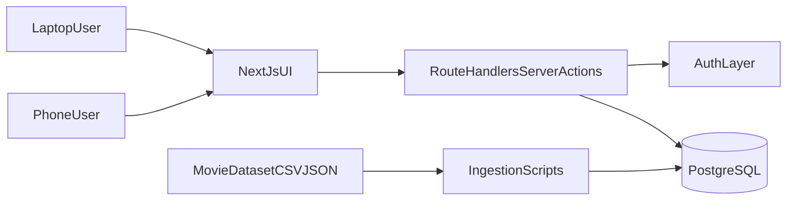

# Build Movie Rating MVP (Next.js)

## Goals

- Ship an MVP where users can browse/search movies from a dataset, create accounts, and submit ratings/reviews.
- Ensure responsive UI for laptop and phone from day one.

## c

- **Frontend + Backend**: Next.js App Router (`app/`) with server actions/API route handlers.
- **Database**: PostgreSQL via Prisma.
- **Auth**: NextAuth/Auth.js with email+password (credentials) for MVP.
- **Dataset ingestion**: One-time + repeatable seed/import scripts that load movie CSV/JSON into normalized tables.
- **Styling/UI**: Tailwind CSS + accessible component primitives.

## Phase 1: Project Foundation

- Initialize Next.js TypeScript app with Tailwind and ESLint.
- Add Prisma + PostgreSQL setup and environment management.
- Define core schema:
  - `User`
  - `Movie`
  - `Genre`
  - `MovieGenre`
  - `Rating` (user score per movie)
  - `Review` (optional text tied to rating/movie/user)
- Add initial migrations and a clean local dev setup.

## Phase 2: Dataset Pipeline

- Create import pipeline for movie metadata (title, year, genres, synopsis, poster URL, runtime, language, etc.).
- Build deterministic upsert logic for reruns (prevent duplicates).
- Add seed command for local/dev bootstrap.
- Validate dataset quality (required fields, malformed rows, dedupe strategy).

## Phase 3: Authentication and Access

- Implement sign up, sign in, sign out, and protected routes.
- Ensure only authenticated users can submit ratings/reviews.
- Keep browsing/search public for better discoverability.

## Phase 4: Core MVP Features

- **Browse/Search**
  - Movie list with pagination or infinite scroll.
  - Search by title; optional filter by genre/year.
- **Movie Detail**
  - Full metadata + aggregate score.
  - Reviews feed sorted by latest/helpfulness (latest first for MVP).
- **Ratings/Reviews**
  - Logged-in users can create/update their rating.
  - Optional review text with basic validation and moderation-safe limits.

## Phase 5: Responsive UX (Laptop + Phone)

- Mobile-first layouts with breakpoints for cards, nav, forms, and detail pages.
- Touch-friendly actions (large hit targets, sticky action bar on detail pages).
- Performance pass: optimized images, skeleton loading states, reduced layout shift.

## Phase 6: Quality, Security, and Launch

- Add tests:
  - Unit tests for score aggregation + validation.
  - Integration tests for auth + rating flow.
  - Basic e2e for browse->detail->rate path.
- Add API protections: input validation, rate limiting for write endpoints.
- Deploy on Vercel + managed Postgres, with environment-based configs.

## Initial File/Folder Plan

- Keep existing placeholder files for now: `[/Users/vamsigarghi/code/MyMoviePal/test.py](/Users/vamsigarghi/code/MyMoviePal/test.py)`, `[/Users/vamsigarghi/code/MyMoviePal/test.jsx](/Users/vamsigarghi/code/MyMoviePal/test.jsx)`
- Add app foundation files (during implementation):
  - `[/Users/vamsigarghi/code/MyMoviePal/app/layout.tsx](/Users/vamsigarghi/code/MyMoviePal/app/layout.tsx)`
  - `[/Users/vamsigarghi/code/MyMoviePal/app/page.tsx](/Users/vamsigarghi/code/MyMoviePal/app/page.tsx)`
  - `[/Users/vamsigarghi/code/MyMoviePal/app/movies/page.tsx](/Users/vamsigarghi/code/MyMoviePal/app/movies/page.tsx)`
  - `[/Users/vamsigarghi/code/MyMoviePal/app/movies/[id]/page.tsx](/Users/vamsigarghi/code/MyMoviePal/app/movies/[id]/page.tsx)`
  - `[/Users/vamsigarghi/code/MyMoviePal/prisma/schema.prisma](/Users/vamsigarghi/code/MyMoviePal/prisma/schema.prisma)`
  - `[/Users/vamsigarghi/code/MyMoviePal/prisma/seed.ts](/Users/vamsigarghi/code/MyMoviePal/prisma/seed.ts)`
  - `[/Users/vamsigarghi/code/MyMoviePal/lib/auth.ts](/Users/vamsigarghi/code/MyMoviePal/lib/auth.ts)`
  - `[/Users/vamsigarghi/code/MyMoviePal/lib/db.ts](/Users/vamsigarghi/code/MyMoviePal/lib/db.ts)`

## Acceptance Criteria (MVP)

- Users on laptop and phone can browse/search movies.
- Users can sign up/sign in.
- Authenticated users can rate a movie and optionally leave a review.
- Movie detail page shows aggregate rating and recent reviews.
- Dataset import is reproducible and documented via script command.

